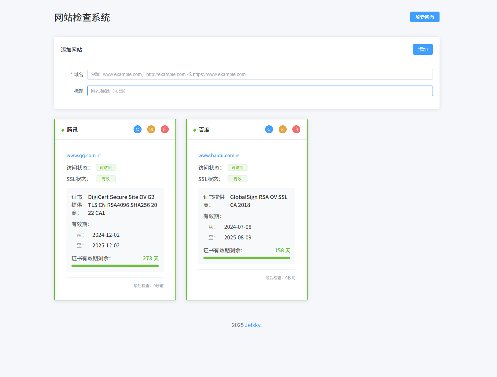

# 网站检查系统 (Website Inspection System)

一个用于监控网站可访问性和SSL证书状态的简单而强大的开源工具。



## 功能特点

- 🔍 监控网站的可访问性状态
- 🔒 检查SSL证书的有效性和到期日期
- 📊 直观的界面展示检查结果
- 🔄 一键刷新所有网站状态
- ⏱️ 智能时间显示（相对时间或具体日期）
- 📱 响应式设计，适配各种设备
- 🌐 支持HTTP和HTTPS协议
- 🔔 显示SSL证书详细信息

## 技术栈

- **前端**: Vue.js 3 + Vite + Element Plus
- **后端**: Node.js + Express
- **数据库**: SQLite (通过Sequelize ORM)
- **API**: RESTful API设计
- **部署**: 支持Docker容器化部署

## 为什么选择这个项目？

- **简单易用**: 直观的用户界面，无需复杂配置
- **轻量级**: 使用SQLite数据库，无需额外的数据库服务
- **可扩展**: 模块化设计，易于添加新功能
- **开源**: 采用MIT许可证，可自由使用和修改
- **跨平台**: 可在Windows、macOS和Linux上运行

## 安装与运行

### 前提条件

- Node.js (v14+)
- npm 或 yarn

### 安装步骤

1. 克隆仓库
   ```bash
   git clone https://github.com/Jefsky/InspectionSystem.git
   cd InspectionSystem
   ```

2. 安装依赖
   ```bash
   npm install
   ```

3. 启动后端服务器
   ```bash
   npm run server
   ```

4. 在另一个终端启动前端开发服务器
   ```bash
   npm run dev
   ```

5. 打开浏览器访问 http://localhost:5173

## 使用指南

1. **添加网站**: 在顶部表单中输入网站域名（和可选的标题），点击"添加"按钮
2. **检查网站**: 系统会自动检查网站的可访问性和SSL证书状态
3. **刷新状态**: 点击单个网站卡片上的刷新按钮或顶部的"刷新所有"按钮
4. **编辑网站**: 点击网站卡片上的编辑按钮修改网站信息
5. **删除网站**: 点击网站卡片上的删除按钮移除网站

## 部署

### 生产环境构建

```bash
npm run build
```

生成的文件将位于 `dist` 目录中，可以部署到任何静态文件服务器。

### Docker部署

1. 构建Docker镜像
   ```bash
   docker build -t website-inspection-system .
   ```

2. 运行容器
   ```bash
   docker run -p 3001:3001 -p 5173:5173 website-inspection-system
   ```

## 配置

可以通过修改 `.env` 文件来配置系统：

```
PORT=3001                 # 后端服务器端口
DATABASE_PATH=./database.sqlite  # 数据库文件路径
```

## 项目结构

```
InspectionSystem/
├── public/               # 静态资源
├── screenshots/          # 项目截图
├── server/               # 后端服务器代码
│   ├── index.js          # 服务器入口
│   └── models.js         # 数据库模型
├── src/                  # 前端源代码
│   ├── assets/           # 资源文件
│   ├── components/       # Vue组件
│   └── App.vue           # 主应用组件
├── .env                  # 环境变量
├── .gitignore            # Git忽略文件
├── index.html            # HTML入口
├── LICENSE               # MIT许可证
├── package.json          # 项目依赖
├── README.md             # 项目说明
└── vite.config.js        # Vite配置
```

## 贡献指南

我们欢迎所有形式的贡献，无论是新功能、bug修复还是文档改进。

1. Fork 本仓库
2. 创建你的特性分支 (`git checkout -b feature/amazing-feature`)
3. 提交你的更改 (`git commit -m 'Add some amazing feature'`)
4. 推送到分支 (`git push origin feature/amazing-feature`)
5. 开启一个 Pull Request

### 贡献者行为准则

作为这个项目的贡献者和维护者，我们承诺尊重所有参与者，无论其背景如何。我们期望项目参与者创建一个友好和安全的环境。

## 路线图

- [ ] 添加用户认证系统
- [ ] 实现通知功能（邮件、短信等）
- [ ] 添加更多的网站检查指标
- [ ] 支持批量导入网站
- [ ] 添加历史数据统计和图表展示

## 常见问题

**Q: 系统支持检查多少个网站？**  
A: 理论上没有限制，但建议控制在合理范围内以保证性能。

**Q: 如何更改检查频率？**  
A: 目前检查是手动触发的，未来版本将添加自动检查功能。

## 许可证

本项目采用 [MIT 许可证](LICENSE)。

MIT许可证是一个宽松的许可证，只要用户在项目副本中包含原始许可证和版权声明，他们就可以自由地使用、修改、分发和私下使用代码，无论是用于商业还是非商业用途。

## 联系方式

Jefsky - [https://www.jefsky.com](https://www.jefsky.com)

项目链接: [https://github.com/Jefsky/InspectionSystem](https://github.com/Jefsky/InspectionSystem)

## 致谢

- [Vue.js](https://vuejs.org/)
- [Element Plus](https://element-plus.org/)
- [Express](https://expressjs.com/)
- [Sequelize](https://sequelize.org/)
- 所有贡献者和用户
